# Luka backend guide

This document explains how the backend is put together: what each part does, how data moves through it, and where to look when you want to change something. It covers everything up to the end of Phase 1 (backend complete, no frontend yet).

For setup commands and the full API table, see the [README](../README.md). For the working agreement and design decisions, see [CLAUDE.md](../CLAUDE.md).

---

## 1. The big picture

Luka helps a company grow its marketing without posting anything on its own:

1. **Onboarding** crawls the company's website and writes six **context documents** (product, audience, brand voice, competitors, content strategy, compliance).
2. Three **agents** run on schedules and draft content into an **inbox**:
   - **Reddit Agent:** finds relevant threads, scores them, and drafts helpful comments
   - **Content Agent:** keeps a backlog of blog topics and drafts full SEO posts
   - **X Agent:** drafts single posts and short threads
3. You **triage** the inbox: edit, regenerate, copy, post it yourself, then mark it posted or dismiss it with a reason.

Two principles shape everything:

- **Agents are deterministic pipelines, not autonomous loops.** Each agent is plain Python run as a Celery task, with an LLM call inside individual steps. You can read an agent top to bottom and know exactly what it does.
- **It's a platform, not a bespoke tool.** Nothing customer- or industry-specific lives in code or prompts. Industry rules are data (policy packs), and knowledge about the company is data (context documents). A test enforces this.

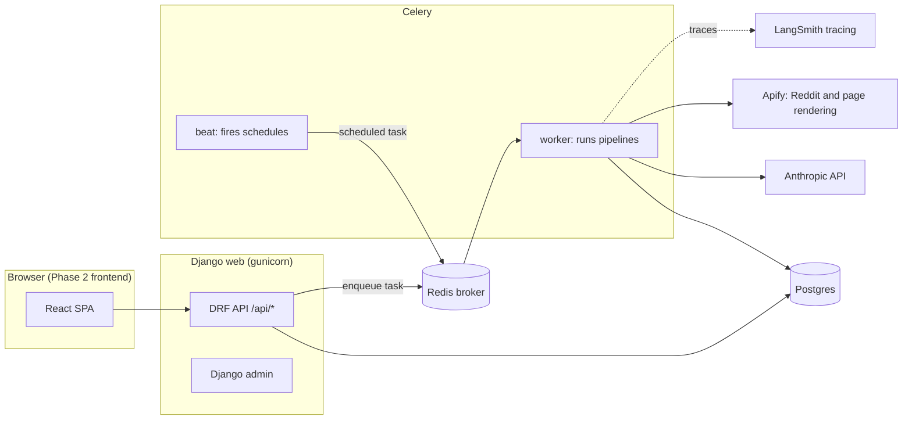

- **The web process never calls the LLM for long work.** It creates a run and enqueues a Celery task, and the browser polls for progress.
- **Beat reads schedules from the database** (django-celery-beat), so editing an agent's schedule takes effect without a restart.

---

## 2. Tech stack

| Layer | Choice |
|---|---|
| API | Django 6 + Django REST Framework, session auth + CSRF |
| Database | PostgreSQL |
| Jobs | Celery worker + Celery beat (DatabaseScheduler), Redis broker |
| LLM | `anthropic` SDK 1.x, called only from `backend/llm/` |
| Models | `claude-haiku-4-5-20251001` ("fast": scoring, classification, lint) and `claude-sonnet-5` ("writer": documents, drafts). Configured in settings. |
| Tracing | LangSmith (`wrap_anthropic` + `@traceable`), plus our own `LLMCall` table for cost |
| Data providers | Apify (`harshmaur/reddit-scraper` for Reddit, `apify/website-content-crawler` for JavaScript-rendered pages) |
| Crawling | httpx + trafilatura + lxml |
| Schema | drf-spectacular (OpenAPI at `/api/schema/`, Swagger at `/api/docs/`) |
| Deploy | Render Blueprint (`render.yaml`) |

---

## 3. Directory map

```
backend/
├── config/                 Django project: settings (base/dev/test/prod), urls, celery app, wsgi
├── llm/                    THE gateway to Claude (the only code that imports `anthropic`)
│   ├── client.py             complete(): build request → call → check stop reason → parse → log cost
│   ├── batch.py              Message Batches: submit / is_done / collect
│   ├── prompts.py            loads versioned prompt files, renders guardrails
│   ├── context.py            builds the cached system prefix (guardrails + context docs)
│   ├── schemas.py            Pydantic models for structured outputs (registered by name)
│   ├── pricing.py            per-call USD cost (cache reads/writes, batch discount, web search)
│   ├── models.py             LLMCall, LLMBatch
│   └── tracing.py            LangSmith hooks
├── prompts/                Versioned prompt files: <task>/vN.md (YAML frontmatter + Jinja)
│   └── _system/guardrails.md the per-project rules template included in every call
├── policies/               Industry policy packs as YAML: general, financial_services, health_wellness
├── providers/              Adapters for outside data (swappable)
│   ├── crawl/                sitemap/BFS crawler, text extraction, PageRenderer (Apify)
│   └── reddit/               RedditSource interface, Apify implementation, fake for dev/tests
├── apps/
│   ├── core/                 Project, auth endpoints, status line, health, shared text helpers
│   ├── policy/               ContentPolicy per project + pack loader + API
│   ├── agents/               AgentConfig, AgentRun, RunEvent, ExternalUsage; registry; scheduling; run API
│   ├── context/              CrawledPage, ContextDocument(+Revision); onboarding pipeline; context API
│   ├── inbox/                Draft, DraftVersion; draft actions; compliance lint; nudges
│   ├── reddit/               RedditPost; Reddit Agent pipeline
│   ├── content/              BlogTopic; Content Agent pipeline; topics API
│   ├── xagent/               X Agent pipeline; X character counting
│   └── stats/                weekly stats API
└── tests/                  pytest; every Anthropic/Apify call is faked
```

### How the apps depend on each other
Arrows mean "imports from". There are no cycles: `llm/` never imports from `apps/`. It gets project data through two provider hooks that apps register at startup.

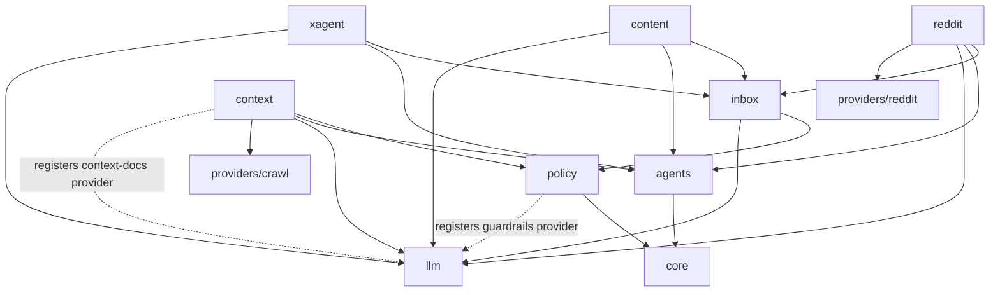

---

## 4. The data model

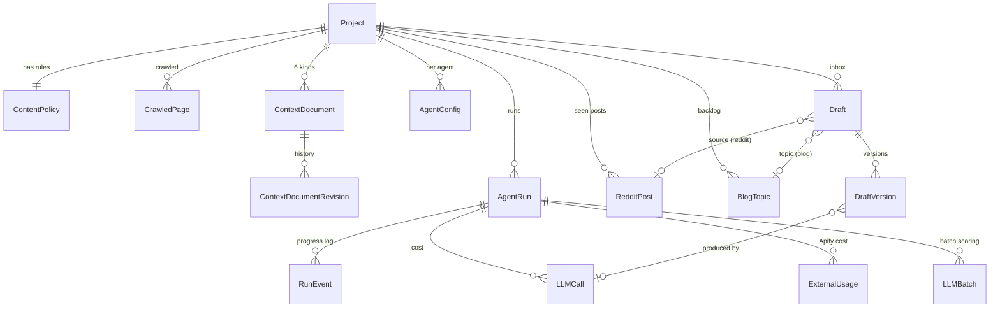

| Model | App | What it is |
|---|---|---|
| **Project** | core | The company being grown: name, website, summary, competitors, and the `owner` who created it. A user may own several. Which one a request acts on is decided in `apps/core/selection.py`. |
| **ContentPolicy** | policy | The project's content rules, the author role ("founder"), the disclosure template and the blog disclaimer. Seeded from a policy pack. |
| **CrawledPage** | context | Text of each crawled page (replaced on every crawl). |
| **ContextDocument / Revision** | context | The six documents. Each save (AI, human edit, or from policy) creates a revision. |
| **AgentConfig** | agents | Per agent: enabled, cron, config JSON (validated by the agent's Pydantic model), publish mode (always `manual` for now). |
| **AgentRun** | agents | One execution of any pipeline (onboarding, recrawl, regenerate, reddit, content, x). Has status, current step and stats. |
| **RunEvent** | agents | The progress log of a run. Powers the progress UI and the status line. |
| **ExternalUsage** | agents | Apify spend per run (rendering, Reddit search). |
| **LLMCall / LLMBatch** | llm | Every Claude call, including failures: tokens, cache hits, cost, latency, prompt version, request ID. Batches track Message Batches jobs. |
| **RedditPost** | reddit | Every post the Reddit Agent has seen, with its score. A scored post without a draft is on the "skipped" list. |
| **BlogTopic** | content | A proposed, requested, drafted or rejected blog topic. |
| **Draft / DraftVersion** | inbox | An inbox item and its full version history (AI initial → your edit → AI regenerated…). Also holds compliance flags, read, posted and dismissed state, and the dismiss reason. |

**The evaluation dataset.** The spec asked for this, and it falls out of `DraftVersion` + `Draft`: for each draft you can compare the last AI version with what you edited and posted, see which prompt version and model produced it, and see why drafts were dismissed. That's the raw material for improving prompts later.

---

## 5. Core mechanisms

### 5.1 Runs: how every pipeline executes
Every long operation is an `AgentRun` processed by a Celery task. All pipelines share the same lifecycle:

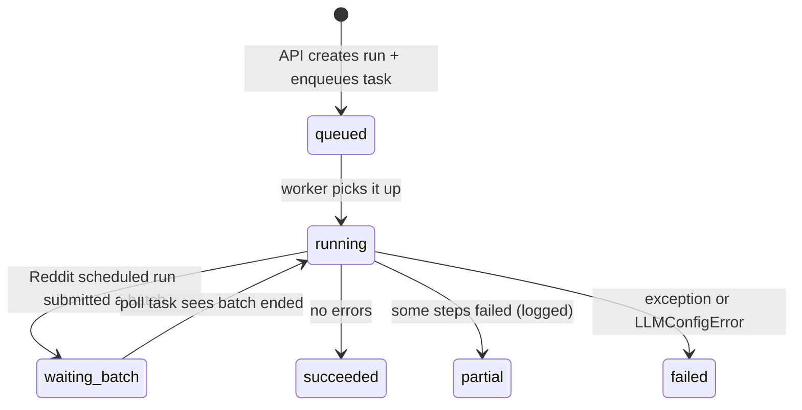

- `create_run()` (`apps/agents/runs.py`) refuses to start a run when an active run of a conflicting kind exists; the API returns **409**. For example, only one context-changing run (onboarding, recrawl or doc regeneration) can be active at a time.
- `running(run)` is a context manager that sets the status and timestamps and catches exceptions, so a crash marks the run `failed` with the error text.
- `RunReporter`'s `step()` updates the **status line** text, while `event()`, `success()`, `warning()` and `error()` append to the progress log. `error()` also makes the run end as `partial` instead of `succeeded`.
- `GET /api/runs/<id>/events/?after=<last id>` lets a client poll progress incrementally, and `GET /api/status/` returns active runs for the sidebar.

### 5.2 One LLM call, end to end
Every call goes through `llm.complete(task, variables, project=..., run=...)`:

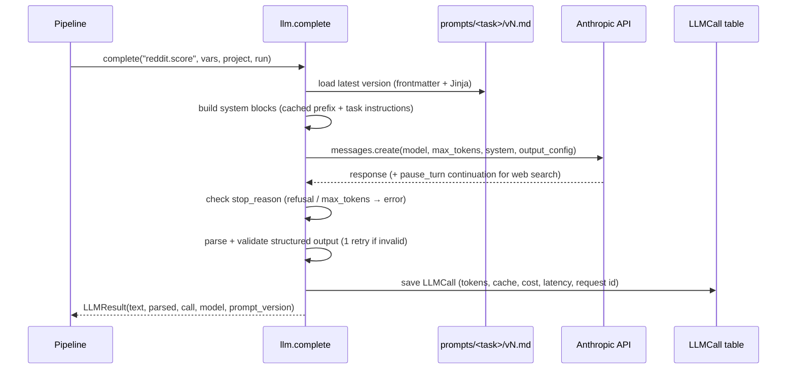

**The prompt file** (`prompts/reddit/score/v4.md`, for example) looks like this:

```
---
model_tier: fast          # fast = Haiku, writer = Sonnet (settings.LLM_MODELS)
max_tokens: 400
effort: medium            # optional; Haiku doesn't take it
schema: RelevanceScore    # Pydantic model in llm/schemas.py → structured output
tools: [web_search]       # optional server tool
include_guardrails: true  # prepend the project's content rules (default)
include_context: true     # prepend the six context documents (default)
---
=== system ===
Task instructions…
=== user ===
The per-item message, with {{ variables }}
```

**The system prompt layout** is designed for prompt caching:

```
┌──────────────────────────────────────────────────────────┐
│ Block 1  Guardrails (rendered from the ContentPolicy)     │  identical for every call
│          + context documents                              │  in this project
├──────────────────────────────────────────────────────────┤
│ Block 2  extra_cached (optional; crawled site during       │  identical across the 5
│          onboarding)                ← cache breakpoint    │  document calls
├──────────────────────────────────────────────────────────┤
│ Block 3  Task instructions (from the prompt file)         │  varies by task
└──────────────────────────────────────────────────────────┘
  user message: the item (post, topic, draft…)            varies by call
```

Block 1 is rendered deterministically (fixed order, no timestamps), so repeated calls hit the cache: about 77% of prompt tokens in real use. Caches are per model, so Haiku and Sonnet each warm their own.

**How failures surface:**

| Situation | Raised | Pipelines usually… |
|---|---|---|
| API error, overload, network | `LLMError` | log it on the run and continue with the next item |
| `stop_reason == "refusal"` | `LLMRefused` (an `LLMError`) | same |
| `stop_reason == "max_tokens"` | `LLMTruncated` (an `LLMError`) | same |
| Output fails the schema twice | `LLMOutputInvalid` (an `LLMError`) | same |
| Missing or rejected API key | `LLMConfigError` (**not** an `LLMError`) | fail the whole run immediately |

Failed calls are still saved as `LLMCall` rows, so costs and errors are visible.

**Prompt versioning:** never edit a prompt that has produced drafts. Add `v<N+1>` instead; the loader always uses the highest version. Each `DraftVersion` and `LLMCall` records the prompt version and model. Superseded versions are deleted from the repo once nothing pending uses them, and git keeps the history.

### 5.3 Message Batches (cheaper scoring)
Scheduled Reddit runs score posts through the Message Batches API (50% cheaper, results usually within minutes). "Run now" scores synchronously so you don't wait.

```mermaid
sequenceDiagram
    participant R as Reddit run (scheduled)
    participant B as llm.batch
    participant A as Anthropic Batches
    participant T as poll_scoring_batch task
    R->>B: submit("reddit.score", [(post-12, vars), …])
    B->>A: batches.create(requests)
    R->>R: status = waiting_batch; schedule poll in 120s
    loop until ended (max 24h)
        T->>B: is_done(batch)?
        B->>A: batches.retrieve
    end
    T->>B: collect(batch)
    B->>A: batches.results (any order, keyed by custom_id)
    B-->>T: results per post (LLMCall saved per item, batch-discounted)
    T->>T: apply scores → draft replies → run succeeded
```

### 5.4 Content policy and guardrails
This is how Luka stays safe across industries without hardcoding any of them.

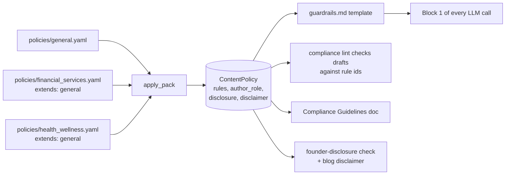

- **Packs extend `general`.** Applying `financial_services` gives the 6 general rules plus 3 finance rules as one list. A pack can override a general rule by reusing its id.
- **The project's policy is a copy of the pack**, so your edits are never overwritten by pack changes. The flip side: new rules added to a pack later don't reach existing projects until the pack is re-applied.
- **Every project always has a policy.** It starts as `general`, onboarding suggests a better pack (`source=suggested`), and anything you set yourself (`source=user`) is never overwritten.
- Removing the `missing_disclosure` rule turns off both the disclosure instruction and the code-level disclosure check.
- API: `GET/PATCH /api/policy/`, `GET /api/policy/packs/`, `POST /api/policy/apply-pack/`.

### 5.5 Compliance lint
After every AI draft or regeneration, `apps/inbox/compliance.lint()`:
1. runs **deterministic checks**: a community post (Reddit) that names the product without a disclosure gets a `missing_disclosure` flag
2. runs a **Haiku review** (`compliance.lint` prompt) against the policy's rule ids
3. stores the flags on the draft as `[{rule, excerpt, explanation}]`

Agents add their own deterministic flags: `seo` for meta descriptions over 160 characters, `length` for X posts over the limit. **Flags never block anything**; they're warnings for the human reviewer.

### 5.6 Scheduling
- Saving an agent's config (`PATCH /api/agents/<type>/`) validates the cron and upserts a django-celery-beat `PeriodicTask` named `agent:<project>:<type>`.
- Beat fires `run_scheduled_agent(project_id, agent_type)`. It does nothing if the agent is disabled, and skips if a previous run is still active, for example one waiting on a batch.
- Default schedules: Reddit every 4 hours, Content Mondays 09:00 UTC, X weekdays 14:00 UTC. All agents start **disabled**.

### 5.7 The agent registry
Each agent registers itself at startup (`apps/<agent>/agent.py`):

```python
register(AgentSpec(
    agent_type="reddit", label="Reddit Agent",
    config_model=RedditAgentConfig,   # validates AgentConfig.config
    run=run_reddit_agent,             # (run, reporter) -> None
    regenerate=regenerate,            # (draft, nudge, instruction, run) -> DraftVersion
    default_cron="0 */4 * * *",
))
```

The generic pieces (run-now API, scheduled task, regenerate task, config API) look agents up in the registry, so they never change when an agent is added.

### 5.8 Cost tracking
- **LLM:** every call's cost is computed from its tokens (`llm/pricing.py`, with prices in settings), including cache writes (1.25×), cache reads (0.1×), the batch discount (50%) and web searches.
- **Apify:** `ExternalUsage` records each actor run's `usage_total_usd`.
- **Rollup:** `GET /api/stats/` totals both by week, agent, model and purpose.

---

## 6. The main flows

### 6.1 Onboarding: website → context documents
`POST /api/onboarding/start/ {website_url, name?, max_pages?}` → `onboarding_task` → `apps/context/pipeline.run_onboarding`

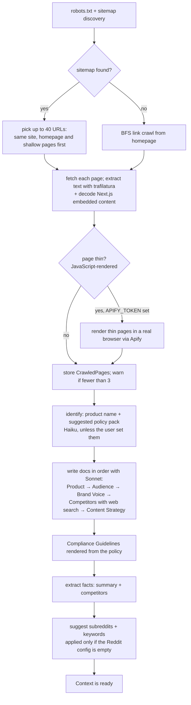

Details worth knowing:
- The crawled site goes into cache block 2, so the five document calls pay for it roughly once.
- Each later document sees the earlier ones, so they stay consistent.
- If one document fails, the others continue and the run ends `partial`.
- **Re-crawl** (`POST /api/context/recrawl/`) runs the same pipeline but keeps documents you edited, unless `overwrite_edited` is set.
- **Regenerate one document** (`POST /api/context/docs/<kind>/regenerate/`) reuses the stored pages.
- Edits (`PATCH /api/context/docs/<kind>/`) are saved as a `human` revision.

### 6.2 Reddit Agent
`POST /api/agents/reddit/run-now/` (manual) or beat (scheduled) → `apps/reddit/pipeline.run_reddit_agent`

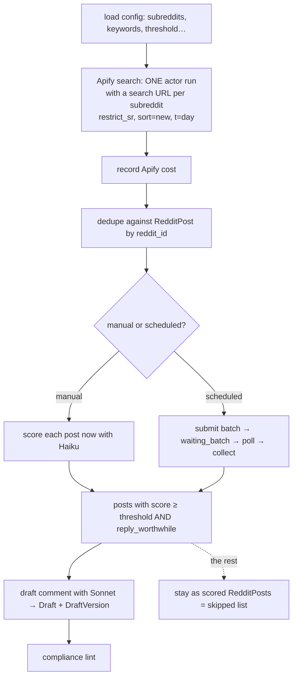

- **Search terms favor recall:** single words go in bare, multi-word terms are grouped (`(team deadlines)`), and only keywords you quote yourself are matched exactly. Scoring then filters for precision. Exact-phrase matching on every keyword found 0 posts in a live test.
- **The scorer** (`reddit.score` v4) judges domain fit (what the product actually does), audience fit (including geography from the Target Audience doc) and whether the post can be answered within the content rules. It aims to pass about 1 in 5 posts.
- **The comment writer** (`reddit.comment` v3) is helpful first, mentions the product only when relevant (with the disclosure), avoids stale figures and aims for 60–180 words.
- `GET /api/agents/reddit/skipped/` lists scanned posts that weren't drafted, highest score first, for tuning the threshold.

### 6.3 Content Agent
→ `apps/content/pipeline.run_content_agent`

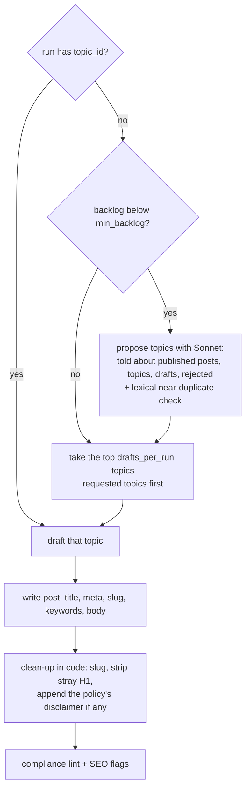

- Request a specific topic with `POST /api/agents/content/topics/ {title, angle?, keywords?, draft_now}`.
- Draft a backlog topic now with `…/topics/<id>/draft/`.
- Reject a topic with `…/topics/<id>/reject/`. Rejected topics are never proposed again.

### 6.4 X Agent
→ `apps/xagent/pipeline.run_x_agent`

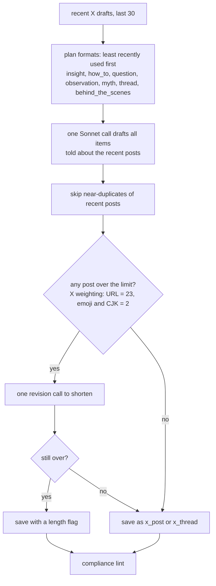

"Copy & open" for X opens `x.com/intent/post` with the first post pre-filled.

### 6.5 Triaging a draft
All under `/api/drafts/<id>/`:

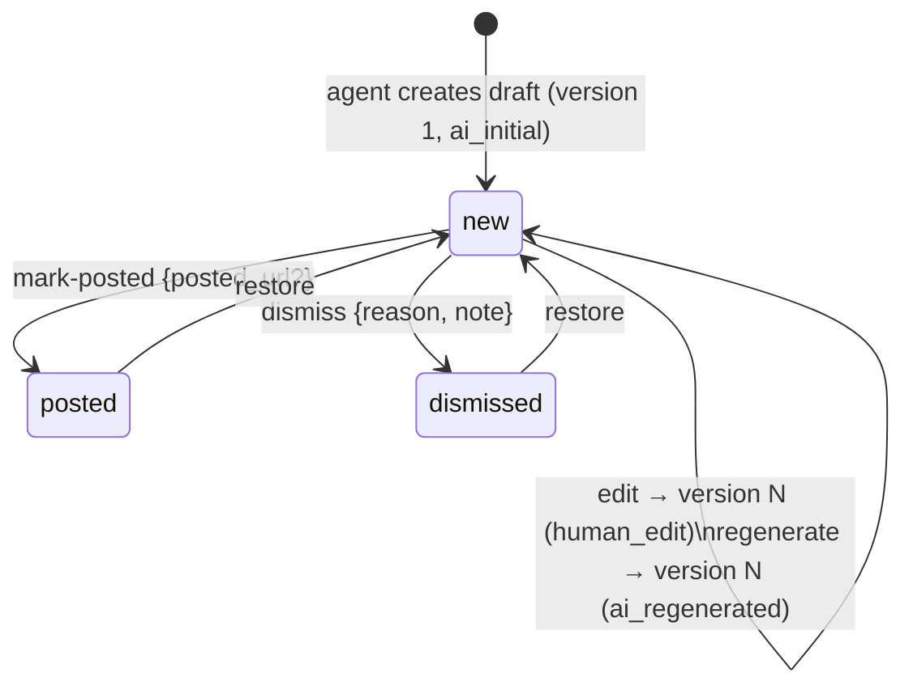

- **Edit** accepts partial content: unsent fields are kept, for example when editing only a blog title. The original AI version is always kept.
- **Regenerate** takes a nudge (`shorter`, `more_casual`, `no_mention`, or `custom` with an instruction). It runs as a background run, revises the current version (including your edits), and re-runs the compliance lint. Only one regeneration per draft at a time.
- **The detail response** includes everything a UI needs: `content`, `copy_text` (what to put on the clipboard), `open_url` (the Reddit thread or X compose), the source post or blog topic, compliance flags, all versions and `char_limit`.
- `GET /api/inbox/counts/` returns sidebar badges: unread, ready per agent and flagged.

---

## 7. External providers (adapters)

| Interface | Implementations | Chosen by |
|---|---|---|
| `RedditSource.search(RedditSearch) → RedditSearchResult` (`providers/reddit/base.py`) | `ApifyRedditSource`, `FakeRedditSource` | `REDDIT_SOURCE=apify\|fake` |
| `PageRenderer.render(urls) → RenderResult` (`providers/crawl/render.py`) | `ApifyRenderer` | used when `APIFY_TOKEN` is set |
| `crawl_site(url, max_pages, progress, renderer)` (`providers/crawl/crawler.py`) | the built-in crawler | — |

Pipelines depend only on the interfaces. Moving to the official Reddit API means one new class plus a settings switch.

---

## 8. Testing

- `pytest` in `backend/`, or `docker compose run --rm web pytest`: 134 tests.
- **No network calls.** `tests/fakes.py` provides `FakeAnthropic`, which can answer requests in order or route them with a `responder(params)` function based on the output schema or prompt text, and fakes the batches API. Apify is faked the same way. (In the 1.x SDK, HTTP-mocking tools like respx don't see the SDK's requests, which is why the client is swapped with `llm.client.set_client()` instead.)
- **Pipeline tests run the real prompt files** through the fake client, so a prompt that references a missing variable fails the tests.
- `tests/test_platform_neutral.py` fails if an active prompt or application code contains industry-specific terms.
- `tests/test_stats_and_deploy.py` keeps the OpenAPI schema warning-free, because the frontend's TypeScript types are generated from it.

---

## 9. Configuration

Settings live in `config/settings/base.py`, with dev, test and prod variations. Everything secret or environment-specific comes from environment variables (see `.env.example`). The main knobs:

| Setting | Default | Meaning |
|---|---|---|
| `LLM_MODEL_FAST` / `LLM_MODEL_WRITER` | Haiku 4.5 / Sonnet 5 | model per tier |
| `LLM_PRICING` | Haiku $1/$5, Sonnet 5 $2/$10 per MTok | cost calculation |
| `REDDIT_SOURCE` | `apify` | or `fake` for local testing without Apify spend |
| `LLM_BATCH_POLL_SECONDS` | 120 | how often scheduled runs check their batch |
| `CRAWL_MAX_PAGES` / `CRAWL_DELAY_SECONDS` | 40 / 0.2 | onboarding crawl limits |
| `CONTEXT_SITE_CHAR_BUDGET` | 240,000 | crawled text sent to the model (overflow is reported) |

Agent behaviour (subreddits, thresholds, formats, schedules…) is per-project data in `AgentConfig`, not settings.

---

## 10. How to extend it

| I want to… | Do this |
|---|---|
| Change a prompt | Copy `prompts/<task>/vN.md` to `vN+1.md` and edit it. It's used from the next call. |
| Support a new industry | Add `policies/<id>.yaml` with `extends: general` and its rules and disclaimer. No code changes. |
| Add an agent | New app with `config.py` (Pydantic), `pipeline.py` (`run` + `regenerate`), `agent.py` (`register(AgentSpec(...))`), a draft kind in `apps/inbox/content.py`, and prompt files. Add the app to `INSTALLED_APPS`. |
| Swap the Reddit data source | Implement `RedditSource` and return it from `apps/reddit/pipeline.get_source()`. |
| Add auto-publishing later | `AgentConfig.publish_mode` is the hook. Add a mode and a publisher that runs after `create_draft`. |
| Let several people share one project | Projects have a single `owner` today. Add a membership table and resolve through it in `apps/core/selection.py`; every query already filters by project. |

---

## 11. Known limitations and follow-ups

- **Scorer variance.** Haiku relevance scores vary by about ±10 between runs, so posts near the threshold can flip. Options: average two scores, or score with Sonnet.
- **The compliance lint over-flags** in strict packs (it flagged a general explanation as "personalized advice"). Options: per-rule "OK" examples in packs, or a per-pack sensitivity setting.
- **Pack updates don't propagate** to existing projects (policies are copies). A future design could store "pack + the customer's changes" instead.
- **Single project.** Multi-tenancy is out of MVP scope; see "How to extend it".
- **Run history cost.** The design brief shows cost per run. Calls are already linked to runs; a small serializer addition would expose the total.
- **Deployment is untested on Render.** `render.yaml` validates against Render's schema, but hasn't been deployed yet.
